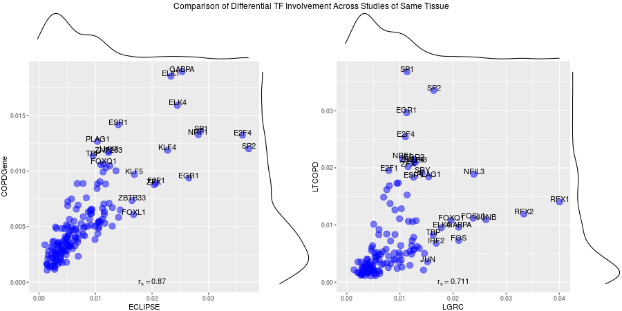
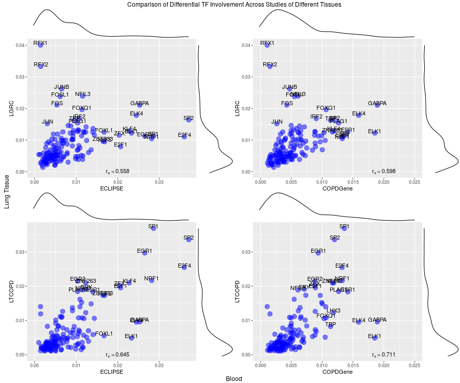

R 
```{r}
library(data.table)
library(ggplot2)
library(knitr)
```

```{r, echo=T, message=F, warning=F, results='hide', cache=TRUE}
ECLIPSE_Blood_Motif <- data.table(read.delim("~/gd/Harvard/Research/data/Eclipse/ECLIPSE_Blood_Motif.txt", header=FALSE, stringsAsFactors=FALSE))
ECLIPSE_Blood_Motif
ECLIPSE_Blood_Motif[V1=="GABPA",]
print(ECLIPSE_Blood_Motif[V2=="IRP2",])


motifs_new <- read.delim("~/gd/Harvard/Research/data/GTEx/KG_cisbp_652(with1).txt", header=FALSE, stringsAsFactors=F)
TFmappings <- read.table("~/gd/Harvard/Research/data/GTEx/cisbpall_motinf.txt", header=T)
TFmappings[,1] <- substring(TFmappings[,1],0,5) 

library(org.Hs.eg.db)
symbols <- mapIds(org.Hs.eg.db, keys=motifs_new[,2],column="SYMBOL", keytype="ENSEMBL", multiVals="first")
motifs_new[,2] <- symbols

motifs_new[,1] <- TFmappings[match(motifs_new[,1], TFmappings[,1]),2]

write.table(motifs_new,"~/gd/Harvard/Research/data/motifs695.txt", quote=F, col.names = F, row.names = F)

motifs_new <- data.table(motifs_new)
TF <- 'ELK1'
length(unique(ECLIPSE_Blood_Motif[,V2]))
length(unique(motifs_new[,V2]))
paste('Motifs189:',length(sort(ECLIPSE_Blood_Motif[V1==TF&!is.na(V2),V2])))
paste('Motifs695:',length(sort(motifs_new[V1==TF&!is.na(V2),V2])))
sum(sort(motifs_new[V1==TF&!is.na(V2),V2])%in% sort(ECLIPSE_Blood_Motif[V1==TF&!is.na(V2),V2]))

```

# Applying to new motif scan
There were `r prettyNum(length(unique(ECLIPSE_Blood_Motif[,V1])))` TFs and `r prettyNum(length(unique(ECLIPSE_Blood_Motif[,V2])))` genes in the older motifs scan for a total of `r prettyNum(nrow(ECLIPSE_Blood_Motif), big.mark=",",scientific=FALSE)` prior edges

There are `r length(unique(motifs_new[,V1]))` TFs and `r length(unique(motifs_new[,V2]))` genes in the newer motifs scan for a total of `r prettyNum(nrow(motifs_new), big.mark=",",scientific=FALSE)` prior edges

Overlap between datasets is not particularly strong.

```{r, echo=T}
TFComparison <-  function(TF){
  print(paste('Old Motif dataset:',length(sort(ECLIPSE_Blood_Motif[V1==TF&!is.na(V2),V2]))))
  print(paste('New Motif dataset:',length(sort(motifs_new[V1==TF&!is.na(V2),V2]))))
  print(paste('Overlap:',sum(sort(motifs_new[V1==TF&!is.na(V2),V2])%in% sort(ECLIPSE_Blood_Motif[V1==TF&!is.na(V2),V2]))))
}
TFComparison('SP1')
TFComparison('ELK1')
TFComparison('GABPA')

```

## Application to new dataset
```{r, echo=F}
clinical <-read.table("~/gd/Harvard/Research/data/LTCOPD/LTCOPD_clinical.txt",header=T,fill = TRUE, sep="\t",row.names=1)
rownames(clinical) <- substr(rownames(clinical), 1, 10)
```

LTCOPD

Study contained `r sum(clinical$COPD=='case')` cases and `r sum(clinical$COPD=='cont')` controls 
Gender: 
```{r}
kable(table(clinical$COPD,clinical$Gender))
kable(table(clinical$COPD,clinical$race))
kable(table(clinical$diagnosis,clinical$COPD))
ggplot(data.frame(clinical), aes(age, fill = COPD)) +
  geom_histogram(binwidth = 2, alpha = 0.8, aes(y = ..density..), position = 'identity') + ggtitle('Histogram of Age')
ggplot(data.frame(clinical), aes(packyears, fill = COPD)) +
  geom_histogram(binwidth = 10, alpha = 0.8, aes(y = ..density..), position = 'identity') + ggtitle('Histogram of pack-years')
```



