Biweekly Update
========================================================
author: Dan Schlauch
date: March 7, 2016

Agenda
========================================================

- Objectives for Manuscript
    - Better communicate the story
    - ??
    - Biological insight
        - Send to Ed, Craig when ready for their input.

The story (Part 1: Setup)
========================================================
- There is a challenge in Network Inference
    - NI methods can be effective, but are weak at context specific results.
    - Existing NI methods can often perform well when measured against gold standards such as ChIP, but context specific validation is lacking.  Differential regulation.
    - Inferring GRNs from expression data and then computing network differences do not yield repeatable results (see later slides)

The story (Part 2: Solution)
========================================================
-  Our method tackles this problem
    1. Our method produces **repeatable results**
        - Strong correlation across independent studies of different tissues.
        - Strongest correlation across same tissues in independent studies.
    2. Our method's results are **biologically relevent** and **independently verified**.
        - Mitochondrial function, other biopoetry needed here.
        - CONDOR
    3. These results **could not have been obtained** via conventional methods.
        - Differential expression, comparing edges...
        
Additionally,
========================================================

- For supplemental arguments...
    1. Our method has a strong intuitive theoretical basis.
    2. Our method works in simulations with known drivers of state transitions.
    3. Our method is fast for high throughput scale data.
    

New supporting results:
========================================================
The following plots demonstrate that commonly used NI methods to not produce reproducible results.

Edgeweight differences for COPD and Smoker Controls were taken across studies.

Edgeweight differences are essentially uncorrelated across studies.

This holds for all tested NI methods.

========================================================

WGCNA  
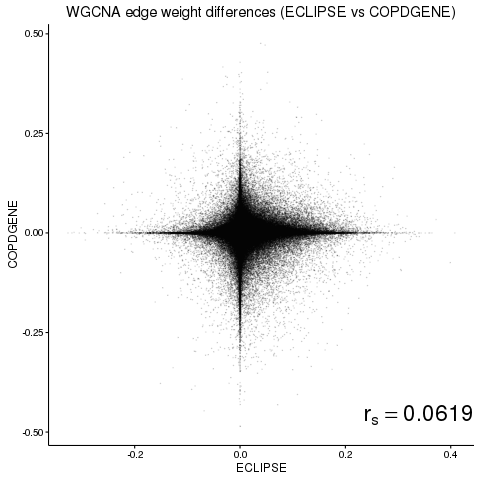
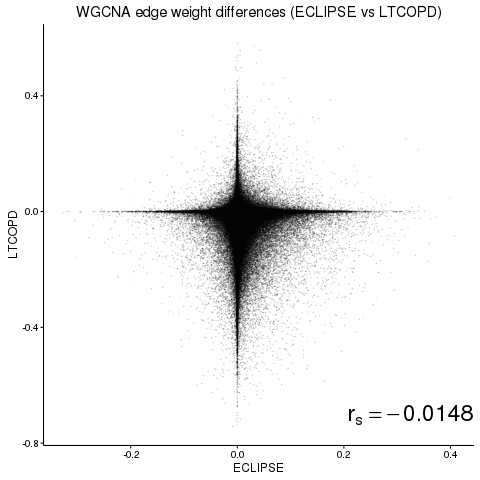
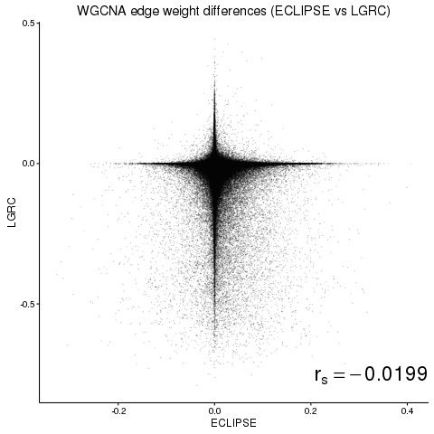  
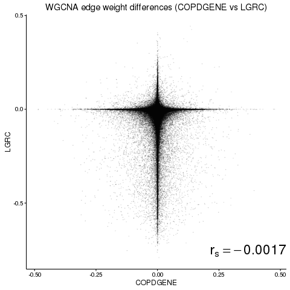

 

========================================================

Context Likelihood of Relatedness (CLR)  
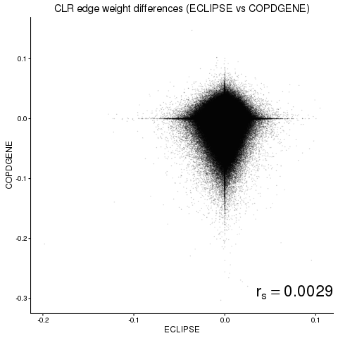

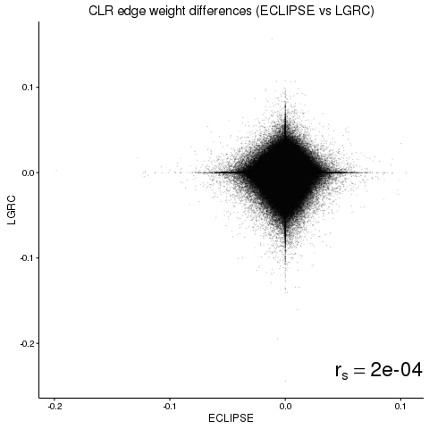  

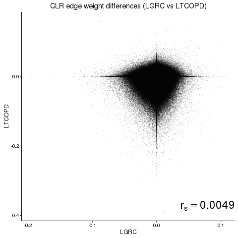 

========================================================

Algorithm for the Reconstruction of Gene Regulatory Networks (ARACNE) 

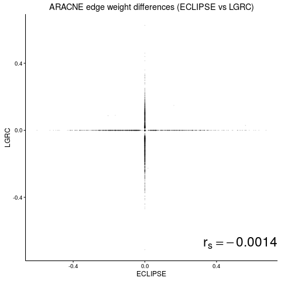  
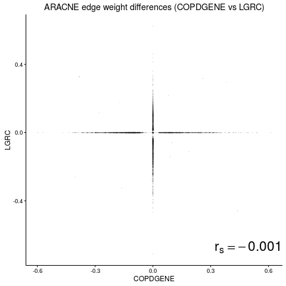

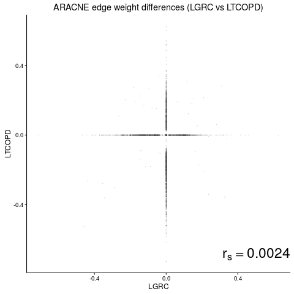 

========================================================

BERE 
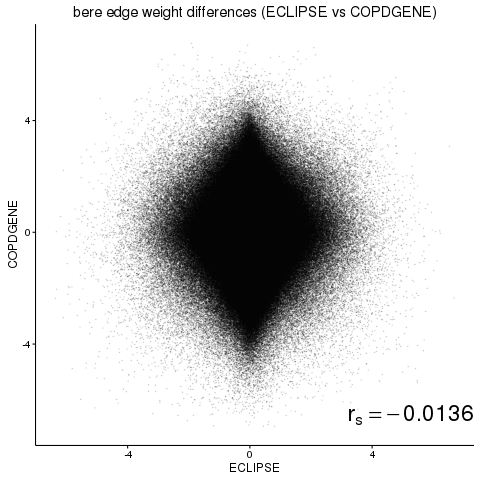
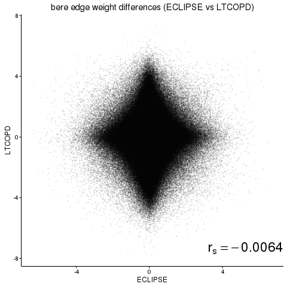
  

 

Edgeweight differences do not validate across studies!
========================================================
So, are NI methods for context-specific networks useless?

Is there any way to observe drivers of state transitions at the network level using this information?

Yes! The [TM NAME] method focuses on regulatory patterns rather than individual edges and DOES validate across studies

Misc. manuscript tasks...
========================================================
Figure 1.
JQ comments:
"the matrices should represent the networks"
 
 

Misc. manuscript tasks...
========================================================
$$B=AT$$ is now
$$B=A\Psi$$ 

Misc. manuscript tasks...
========================================================
 

Misc. manuscript tasks...
========================================================
More supporting literature validation

*Autophagy in chronic obstructive pulmonary disease: Homeostatic or pathogenic mechanism?*
Ryter (2008 and 2010), others
- E2F4 (one of the top hits in all studies) binds with EGR-1 (top 5 hit in ECLIPSE and LTCOPD, also towards the top of LGRC and COPDGENE) in response to stress (such as smoke).

*Egr-1 Regulates Autophagy in Cigarette Smoke-Induced Chronic Obstructive Pulmonary Disease*
Chen et al. (2008)

Misc. manuscript tasks...
========================================================
ELK1, ELK4 implicated in asthma.

*Emerging role of MAP kinase pathways as therapeutic targets in COPD*
Mercer (2006)
ELK1 phosphorylated by ERK1/2
